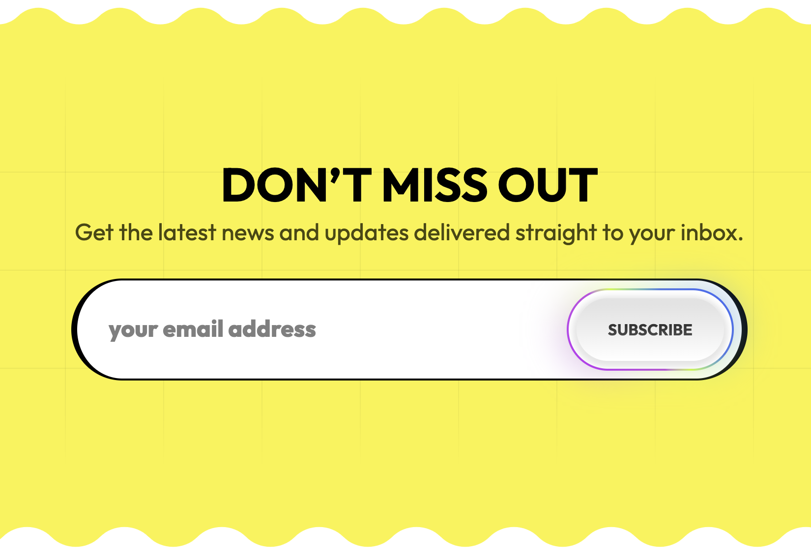

# Newsletter Footer Component 📨

### [Demo](https://hsiaooooooju.github.io/newsletter_footer)

The task was to implement a footer based on a given Figma design using HTML and CSS (with optional frameworks/tools).
This project is deployed via GitHub Pages.

### 🎯 Goals
- ✅ Pixel-perfect implementation (fonts, colors, spacing, positioning)
- ✅ Interactive button hover effect
- ✅ Semantic and clean HTML structure
- ✅ Minimal, maintainable CSS (TailwindCSS used)
- ✅ No RWD Required

## 🛠️ Tech Stack

- **React 18**
- **TailwindCSS v4**
- **Custom utility classes with pseudo-elements**
- **Vite** for local development and build

## ✨ Features

- Pixel-accurate design matching Figma
- Semantic HTML5 elements (`<footer>`, `<h2>`, `<input>`, etc.)
- Interactive **gradient button** with hover animations
- Custom background grid pattern and wave SVG

## 📷 Preview



## 🚀 Getting Started

Clone the repo and install dependencies:

```bash
git clone https://github.com/HsiaooooooJu/newsletter-footer.git
cd newsletter_footer
pnpm install
pnpm run dev
